# 52framework  

## Directory

1. [Getting started](#introduction)
2. [Scaffolding](#grid)
3. [Base CSS](#general)
4. [表单](#form)
5. [font与shadow](#css3)

***

<h2 id="introduction">Getting started</h2>  

今天，我们要去 看看从Enavu所谓52框架的新项目。该框架是一个新的综合Html5和CSS3的框架。
HTML5和CSS3仍是新技术，是不是有点太早开始为他们创造框架？绝对不是。对这些新标准都支持在迅速增加，而且应用越来越广。  
无论是时间开始使用HTML5的和CSS3完全是另一场辩论，这里的想法是，它是完美的时 间开始建造系统，以方便他们在不久的将来使用。永远不会有一个时候停止不断发展的Web标准，因此建立完善的气候框架的建立。而不是落后，像这些应该跟上新技术和 发展与他们的工具。鉴于发展商的方式决定，其实时间是开始实施的HTML5和CSS3， 这些工具都已经到位，他们这样做。  

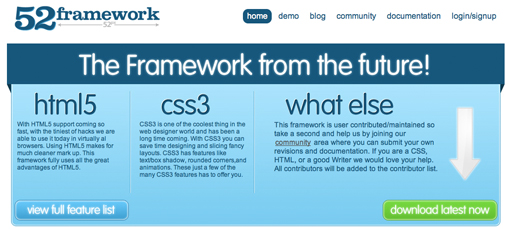  

一旦你下载了框架，就要看看Demo。  

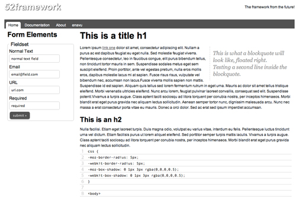  

正如你可以看到，该框架可以帮助你设置了一个最常见的元素数。您的标题标签（H1，H2和H3） 的风格以及基本的页面排版，表单元素准备去和奖金自定义按钮的设计，有一个地方的显示代码，并在地方甚至是其他样式一束方法像强，粗体，斜体，插入的文本不同的 元素，大文字等。    

**下面详细分析下Demo的代码：**    

开头短小精悍：  

    <!DOCTYPE html>  
    
此段js可将吾之html5可为老版本之浏览器之用也～  

    modernizr-1.7.min.js  

然后就是整体结构了：  

    <body>
 
        <header>
            <nav>
            </nav>
        </header>
 
        <aside>
            <form>
            </form>
        </aside>
 
        <section>
            <article>
            </article>
 
            <article>
 
                <code>
                </code>
 
                <article>
                </article>
 
            </article>
 
        </section>
 
        <footer>
        </footer>
 
    </body>

显而易见，非常的简单精悍。使用52框架 将迫使你创建你的网页使用这些新的元素，因此是一个伟大的方式跳进HTML5的到时候。  

下面再看看CSS的经典的网格实现：  

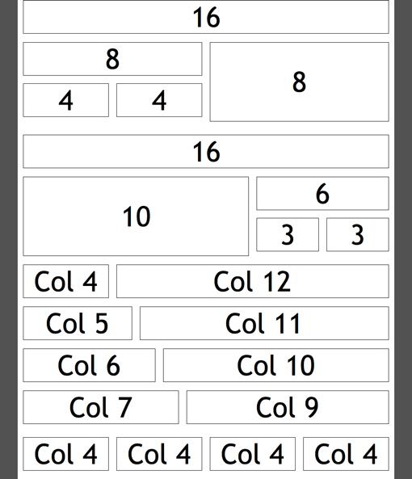  

下面是对应的经典的代码：  

    .col_1 {width:40px;}
    .col_2 {width:100px;}
    .col_3 {width:160px;}
    .col_4 {width:220px;}
    .col_5 {width:280px;}
    .col_6 {width:340px;}
    .col_7 {width:400px;}
    .col_8 {width:460px;}
    .col_9 {width:520px;}
    .col_10 {width:580px;}
    .col_11 {width:640px;}
    .col_12 {width:700px;}
    .col_13 {width:760px;}
    .col_14 {width:820px;}
    .col_15 {width:880px;}
    .col_16 {width:940px;}

下面再看看一般的CSS代码这里是怎样实现的：主要包含了有用的CSS样式的数目，让您开始。在上述网页的一切都随着像其他基本项目的数目，具体的方式结算类和浮动块报价。  

这里是一个实用的功能，你可以设置 一个网页浏览器来覆盖默认选择的颜色。这意味着，当您选择的文本行，重点将是您定义的颜色。  

    ::selection {
        background: #525252; /* Safari */
    }
    ::-moz-selection {
        background: #525252; /* Firefox */
        color:#fff;
    }

你还能看到经典的Css3的圆角的控制代码：  

    { -moz-border-radius: 4px;
    -webkit-border-radius: 4px;
    border-radius: 4px;
    }
    
还有CSS的滤镜以及阴影等：  

    header .logo {
      font-size:2.5em;
      height:52px;
      padding-top:28px;
      font-weight:700;
      text-shadow:1px 1px 2px #000;
      color:#fff;
      filter: Shadow(Color=#666666, Direction=135, Strength=3);}
      
52框架还有好多好多新的强大的功能，期待一下吧。

**link**  
``   
this is the javascript allowing html5 to run in older browsers  

`<link rel="stylesheet" type="text/css" href="../../css/css3.css" media="screen" />`   
in the CSS3 stylesheet you will find examples of some great new features CSS has to offer  

`<link rel="stylesheet" type="text/css" href="../../css/general.css" media="screen" />`  
general stylesheet contains some default styles, you do not need this, but it helps you keep a uniform style  

`<link rel="stylesheet" type="text/css" href="../../css/grid.css" media="screen" />`  
grid's will help you keep your website appealing to your users, view 52framework.com website for documentation   

`<link rel="stylesheet" type="text/css" href="css/mobile.css" media="screen" />`  
this stylesheet required for mobile browsers, inside it allows you to control portrait and landscape modes  

**HTML5 newTags**  

* header和footer  
    <header>
    </header>
    <footer>
    </footer>

没啥好说的。。。就是新加的标签。。。  

* nav标签:The `<nav>` tag defines a section of navigation links.用于导航栏，Not all links of a document must be in a `<nav>`element. The`<nav>`element is intended only for major block of navigation links.       

* col类用于定位文档流的位置。十分重要。`class="col col_9"`使用`col`和`col_9`来确定位置,column指的是栏目的意思。    

* `blockquote`A section that is quoted from another source  

* `article`An article should make sense on its own and it should be possible to distribute it independently from the rest of the site.  

* `pre`Text in a <pre> element is displayed in a fixed-width font (usually Courier), and it preserves both spaces and line breaks.  

* `<abbr>`An abbreviation is marked up，缩写。  
  

``this is the javascript allowing html5 to run in older browsers.  

if IE``  

`<link rel="stylesheet" type="text/css" href="../../css/forms.css" media="screen" />`special styling for forms, this can be used as a form framework on its own   

`<fieldset>` Tag,Group related elements in a form. The `<legend>` tag defines a caption for the `<fieldset>` element.The `<fieldset>` tag is used to group related elements in a form.The `<fieldset>` tag draws a box around the related elements.  

``embeds necessary for html5 video player, take this section out if you are not using the video player.  

需要加上这段js  

    

`border-radius`可以用来Add rounded borders to a div element  

`text-shadow`制造文本阴影～  

 Column widths, and element width based on grid  
 
 localStorage：js  
 
 HTML 5 <input> required 属性required 属性规定必需在提交之前填写输入字段。如果使用该属性，则字段是必填（或必选）的。  
注释：required 属性适用于以下 <input> 类型：text, search, url, telephone, email, password, date pickers, number, checkbox, radio 以及 file。  

HTML <link> 标签的 media 属性,media 属性规定被链接文档将显示在什么设备上。

<h2 id="grid">Scaffolding</h2>

`row`用以指定一行区域。  

    .row{
      width: 960px;
	    margin: 0 auto;
	    overflow: hidden;
    }
    
`col`制定一个栏目column  

    .col {
        margin-left:10px; margin-right:10px;
	      display: inline;
	      overflow: hidden;
	      float: left;
	      position: relative;
    }

`.row .row`row的嵌套，主要在于其宽度较之前增加10px。。。意义不明~  

    .row .row {
      margin: 0 -10px;
	    width: auto;
	    display: inline-block;
    }

`col_n`指其宽度，多应用于浮动流，随n的增加其宽度随之增加。n增加1，width增加60px。  

    .col_1, .width_1   {	width:40px;	 }
    .col_2, .width_2 	 {	width:100px; }
    .col_3, .width_3 	 {	width:160px; }
    .col_4, .width_4 	 {	width:220px; }
    .col_5, .width_5	 {	width:280px; }
    .col_6, .width_6	 {	width:340px; }
    .col_7, .width_7	 {	width:400px; }
    .col_8, .width_8	 {	width:460px; }
    .col_9, .width_9 	 {	width:520px; }
    .col_10, .width_10	 {	width:580px; }
    .col_11, .width_11	 {	width:640px; }
    .col_12, .width_12	 {	width:700px; }
    .col_13, .width_13	 {	width:760px; }
    .col_14, .width_14	 {	width:820px; }
    .col_15, .width_15	 {	width:880px; }
    .col_16, .width_16	 {	width:940px; }

ps:class中的col_n往往与col配合使用~  

<h2 id="general">Base CSS</h2>

`h1`到`h5`的大小  
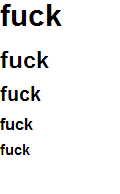

    .left, .float_left  { float:left  }
    .right, .float_right { float:right	}
    .clear { clear:both; display:block; overflow:hidden; visibility:hidden; height:0px;}
    .clear-left, .clear_left { clear:left; } .clear-right, .clear_right { clear:right; }
    .hide  { display:none	} .block {display:block !important;} .inline {display:inline !important;}

    .align_right    { text-align:right;	  }
    .align_left     { text-align:left;	  }
    .align_center   { text-align:center;  }
    .align_justify  { text-align:justify; }

    .bold {font-weight:600;}
    .italic {font-style:italic;}

`left``float_left`float为left  
`right``float_right`float 为right  
`clear`No floating elements allowed on the left or the right side of a specified paragraph  
`clear-left`清除右边元素  
`hide`隐藏元素  
`align`文字剧中  
`blod`文字加粗  
`italic`斜体  

**引用**

`<blockquote>`A section that is quoted from another source  
用于引用外部内容的块级元素  

**选中**  
`::selection`选中的字体颜色  
    
    ::selection {
      background: #525252; /* Safari */
	   }
    ::-moz-selection {
	    background: #525252; /* Firefox */
	    color:#fff;
    }

**强调，地址，缩写**  
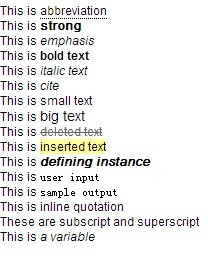

    strong     	{	font-weight:600;}
    em, dfn  		{	font-style:italic;}
    dfn 	 		{   font-weight:600;}
    sup, sub 		{   line-height:0;}
    abbr, acronym   {	border-bottom:1px dashed #ccc;}
    address 		{	margin:0 0 1.5em;font-style:italic;}
    del 			{	color:#666;}
    pre, code, tt   {	font:1em 'andale mono', 'lucida console', monospace;line-height:1.5; display:block;}
    code 			{	background-color:#eee; display:inline; padding:0px 2px 1px 2px; line-height:1.1em;}
    pre 			{	margin:1.5em 0;white-space:pre;}

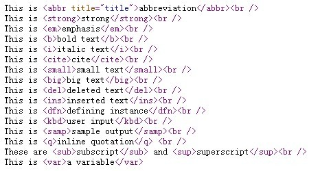

`<abbr>`abbreviation 缩写  
`<strong>`加粗  
`<em>`强调  
`<b>`粗体  
`<i>`斜体  
`<cite>`引用  
`<del>`被划过的字体  
`<ins>`文字被选中  

**代码**  
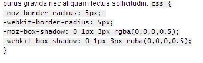

    <code>
                
      css { 
      -moz-border-radius: 5px;  
      -webkit-border-radius: 5px; 
      -moz-box-shadow: 0 1px 3px rgba(0,0,0,0.5); 
      -webkit-box-shadow: 0 1px 3px rgba(0,0,0,0.5); 
      } 
               
    </code>

使用`<code>`包装行级代码片段  
使用`<pre>` 对多行代码进行包装。 切记一定要对代码中的每个`<>`进行转义，这样方能得到正常的渲染结果。

<h2 id="form">表单</h2>

special styling for forms, this can be used as a form framework on its own  
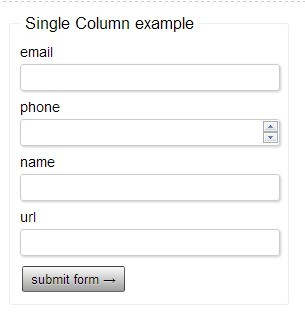

**fieldset**  

      form fieldset {-webkit-border-radius: 3px;//webit内核
        -moz-border-radius: 3px;//火狐内核
        border-radius:3px;//圆角 
        padding:10px; 
        border:1px solid #eee; 
      }  
     
     form fieldset legend {font-size:1.4em; padding:0 5px;}
      
**form input**    

    form input[type=text], form input[type=email], form input[type=url], form input[type=password], form input[type=number], textarea {
  	    -moz-border-radius: 3px; 
		    -webkit-border-radius: 3px; 
		    border-radius:3px; 
		    height:20px; 
		    margin-bottom:5px; 
		    border:1px solid #ccc; 
		    padding:4px 0 1px 5px;
		}
    
**textarea**  

    form .textarea textarea {
        -moz-border-radius: 3px; 
  	    -webkit-border-radius: 3px; 
		    border-radius:3px; 
		    margin-bottom:5px; 
		    min-height:50px;
		    border:1px solid #ccc; 
		    padding:4px 0 1px 5px; width:100%;
    }  
    
**label**  

    form label {display:block; height:20px; font-size:1.2em;}  
    
special form styling  

    form div {height:24px; clear:both; margin-bottom:6px; padding:5px 0px;}
    form div label {float:left; width:auto;}
    form div input {width:52%; float:right;}
    form div input.invalid {border-bottom:1px solid #f00;}
    form fieldset input[type=submit], form fieldset button { display: inline-block;

        padding: 4px 8px;
        font-family: 'Lucida Grande', Arial, sans-serif;
        font-size: 13px;

        -webkit-border-radius: 2px;
        -moz-border-radius: 2px;
        border-radius: 2px;

        border: 1px solid rgba(0, 0, 0, 0.6);

        background: -webkit-gradient(linear, left top, left bottom, from(#fbfcfb), to(#9d9e9d));
        background: -moz-linear-gradient(#fbfcfb, #9d9e9d);
        background-color: #eee;

        text-shadow: rgba(255, 255, 255, 0.4) 0px 1px;

        -webkit-box-shadow: rgba(255, 255, 255, 0.4) 0 1px;
        -moz-box-shadow: rgba(255, 255, 255, 0.4) 0 1px;
        box-shadow: rgba(255, 255, 255, 0.4) 0 1px;

        -webkit-user-select: none;
        -moz-user-select: none;
        cursor:pointer;
    }
    form fieldset input:hover[type=submit], form fieldset button:hover {
	      background: #B5B5B5;
        -webkit-box-shadow: rgba(255, 255, 255, 0.4) 0 1px,
                            black 0px 1px 3px inset,
                            rgba(0, 0, 0, 0.4) 0px -5px 12px inset;

        -moz-box-shadow: rgba(255, 255, 255, 0.4) 0 1px,
                         black 0px 1px 3px inset,
                         rgba(0, 0, 0, 0.4) 0px -5px 12px inset;

        box-shadow: rgba(255, 255, 255, 0.4) 0 1px,
                    black 0px 1px 3px inset,
                    rgba(0, 0, 0, 0.4) 0px -5px 12px inset;

        text-shadow: rgba(255, 255, 255, 0.3) 0px 1px;
    	  cursor:pointer;
    }
    
single column form styling  

    form .s_column div {height:auto; margin-bottom:3px; padding:0px;}
    form .s_column div label {float:none; width:100%;}
    form .s_column div input {width:98%; float:none;}

chrome:  

ie6:  
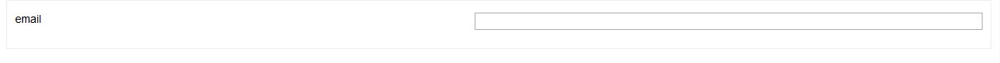

<h2 id="css3">font与shadow</h2>

The CSS3 Text-Shadow property contains the following values:  
horizontal-offset (length, required) | vertical-offset (length, required) | blur-radius (length, optional) | shadow-color (color, optional)  

**fontface**  
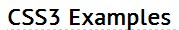

    .fontface { font-family:'PTSansRegular', Arial, sans-serif; }
    
    @font-face {
      font-family: 'PTSansRegular';
	    src: url('PT_Sans-webfont.eot');
	    src: local('☺'), url('PT_Sans-webfont.woff') format('woff'), url('PT_Sans-webfont.ttf') format('truetype'), url('PT_Sans-webfont.svg#webfont6MwxiJev') format('svg');
	    font-weight: normal;
	    font-style: normal;
    }
    
**shadow**  

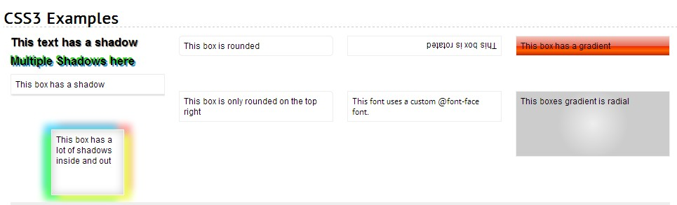

    .shadow {  text-shadow:1px 1px 1px #666; 
	 	    }/*<-- edit the color you wish to use in your shadows */
	
    .shadow_multiple {text-shadow: -2px -2px 0px #1fd31f,
             2px 2px 0px #1f9ad3;
    }

    .rounded {
	    -webkit-border-radius: 5px;
	    -moz-border-radius: 5px;
	    border-radius: 5px;
	    border:1px solid #ccc;
	
    }

    .rounded_top_right {
	    border-top-right-radius:5px;
	    -moz-border-radius-topright:5px;
	    -webkit-border-top-right-radius:5px;
	    border:1px solid #ccc;
	
    }

    .box_shadow {
    	-webkit-box-shadow: 1px 1px 3px #ccc;
    	-moz-box-shadow: 1px 1px 3px #ccc;
    	box-shadow: 1px 1px 3px #ccc;
	
    }
    .box_shadow_multiple {
    	-webkit-box-shadow: 0 0 20px #ccc inset,
		    				10px 7px 15px #f0f961,
				    		-10px 7px 15px #55fc6d,
						    -10px -7px 15px #55d7fc,
						    10px -7px 15px #fc9c9c;
	
  	  -moz-box-shadow: 0 0 20px #ccc inset,
		    				10px 7px 15px #f0f961,
				    		-10px 7px 15px #55fc6d,
						    -10px -7px 15px #55d7fc,
				    		10px -7px 15px #fc9c9c;
	
    	box-shadow:		0 0 20px #ccc inset,
			    			10px 7px 15px #f0f961,
					    	-10px 7px 15px #55fc6d,
					    	-10px -7px 15px #55d7fc,
					    	10px -7px 15px #fc9c9c;
    }

    .rotate {
    	-webkit-transform: rotate(180deg);
	    -moz-transform: rotate(-180deg);
    	filter:progid:DXImageTransform.Microsoft.BasicImage(rotation=2);
    	/* possible properties for the Internet Explorer filter rotation are: 1. Content is rotated 90 degrees.  
	                                      	`														 		  2. Content is rotated 180 degrees.
																 		                                        3. Content is rotated 270 degrees.
	    */
    }

    .gradient {   //渐变
		    background: #f3c5bd; /* old browsers */

    		background: -moz-linear-gradient(top, #f3c5bd 0%, #e86c57 50%, #ea2803 51%, #ff6600 75%, #c72200 100%); /* firefox */
		
	    	background: -webkit-gradient(linear, left top, left bottom, color-stop(0%,#f3c5bd), color-stop(50%,#e86c57), color-stop(51%,#ea2803), color-stop(75%,#ff6600), color-stop(100%,#c72200)); /* webkit */
		
	     	filter: progid:DXImageTransform.Microsoft.gradient( startColorstr='#f3c5bd', endColorstr='#c72200',GradientType=0 ); /* ie */
		
		    /* generated with http://www.colorzilla.com/gradient-editor/ */
	  }
.gradient_radial {
	 background:-webkit-gradient(radial, center center, 0, center center, 50, from(#eee), to(#ccc));
	 background: -moz-radial-gradient(#eee, #ccc); 
}

